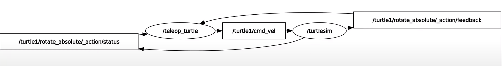

# ROS2-Project

## Introduzione

ROS (Acronimo di Robot Operating System) rappresenta un insieme di librerie software e strumenti destinati alla realizzazione di applicazioni robotiche. Questo sistema include una vasta gamma di componenti, che vanno dai driver alle algoritmi all'avanguardia, fino agli strumenti di sviluppo potenti, fornendo tutto il necessario per lo sviluppo di progetti robotici sofisticati. ROS 2 è stato progettato come evoluzione di ROS 1, con l'obiettivo di rispondere alle esigenze in continua evoluzione nel campo della robotica e dell'automazione, sfruttando i punti di forza di ROS 1 e migliorando gli aspetti che presentavano limitazioni

## I primi passi

Per cominciare a capire il funzionamento di ROS e i suoi componenti principali, è possibile utilizzare varie finestre del terminale per farle successivamente interagire tra di loro. Prima di ciò, però, è importante avere chiaro le varie componenti che costituiscono il core di questo sistema operativo all'avanguardia.

### Nodi

I nodi in ROS sono i componenti fondamentali, che permettono all'applicazione di funzionare correttamente. Ogni nodo è indipendente dagli altri e svolge un particolare compito che gli viene assegnato (tramite codice PYTHON). Per capire come questi nodi operano, è disponibile un pacchetto di demo chiamato 'demo_nodes_*' che ne contiene sia di semplici che di complessi.  
Per fare qualche esempio, è disponibile un nodo di nome 'talker' che si preoccupa di mandare un messaggio di 'Hello World' ogni secondo; è inoltre disponbile un nodo chiamato 'listener' che invece si mette in ascolto di eventuali messaggi. Vi sono altri esempi più complessi, come il 'turtlesim' che rappresenta una tartaruga statica in uno spazio e il relativo nodo 'turtle_teleop_key' che manda i comandi di movimento alla tartaruga dall'input da tastiera.  
Questo insieme di nodi, ovviamente, può essere programmato ad hoc a seconda delle esigenze, prendendo magari spunto da un nodo di demo e modificato a proprio piacimento. Ne deriva inoltre che questi nodi non possono comunicare tra loro se non si adotta una certa politica di comunicazione che, come vedremo in seguito, prende il nome di 'Topic'.

### Topics

Sapendo quindi che ogni nodo è responsabile di una determinata azione, è importante chiarire il funzionamento dei topic che ne permettono la comunicazione tra essi. Quando si aprono finestre di terminale e si decide di assegnare per ognuna un nodo, la loro interazione segue il paradigma 'pub-sub' a scambio di messaggi dove uno o più nodi fungono da publishers e altrettanti da subscribers. Quindi, i topic non sono altro che gli intermediari di comunicazione tra i vari nodi.  
Per capire meglio, qui sotto è disponibile un immagine che chiarisce questo fatto.

### Servizi

### Altro

## Compilazione
